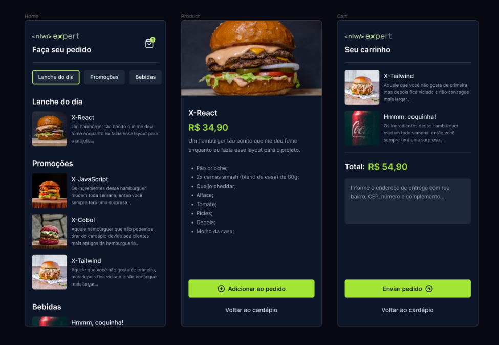

"# nlw-expert-rn" 

## O que é o projeto?

Evento NLW Expert trilha de React Native da Rocketseat,

Desenvolvimento de uma aplicação mobile em React Native, aplicação dos conceitos de Propriedades, Estados e Componentes, tipagem com Typescript, Expo Framework, interface com Native Wind, gerenciamento de estado global com Zustand, roteamento por arquivos com Expo Router.

## Requisitos para o projeto

Pode saber mais sobre os requisitos do projeto, [clicando aqui](https://react-native.rocketseat.dev/).

## Imagens do projeto

